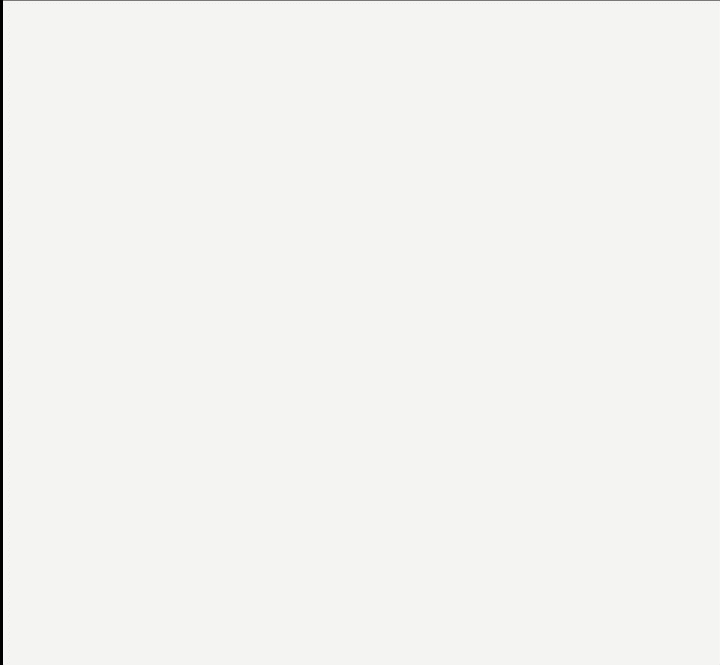
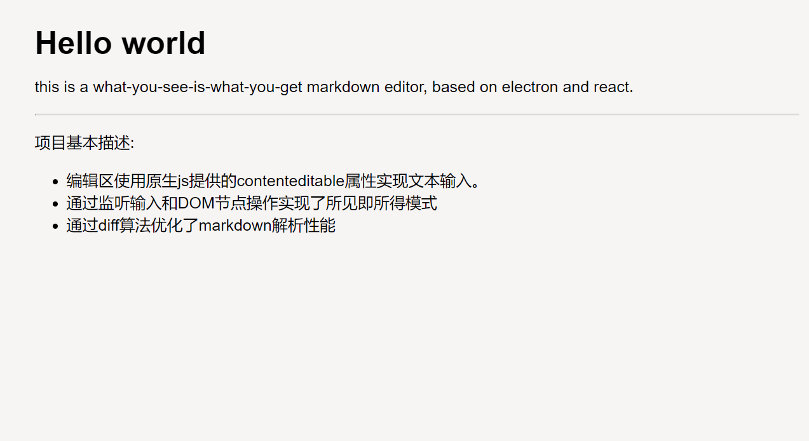

# WoWMEdit

一款桌面所及即所得的markdown编辑器。

### 技术栈

- react
- electron
- [marked](https://github.com/markedjs/marked)
- [turndown](https://github.com/domchristie/turndown)

### 使用方法

- 网页上使用
  - clone到本地
  - npm install
  - npm start
- electron上使用
  - 执行以上步骤，同时保证你的电脑安装了electron
  - npm install electron-builder --save 
  - npm run build
  - node_modules/.bin/electron-builder --win
  - electron .

### 项目效果

